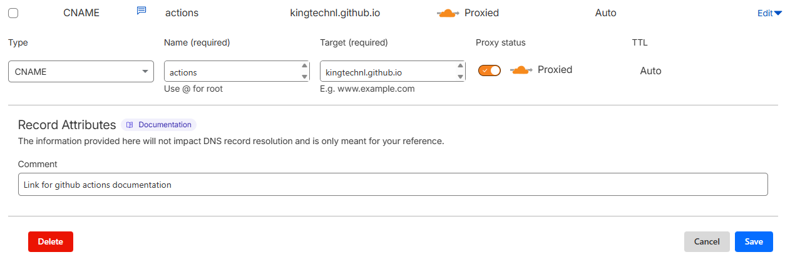

## Deploy-pages action
The `deploy-pages` action deploys static websites to GitHub Pages by pushing the site files to a designated branch (typically `gh-pages`). It automates the entire deployment process, including copying files, configuring custom domains, and force-pushing to the target branch.

This action is perfect for publishing documentation sites, blogs, or any static web content generated by tools like Docusaurus, Jekyll, or Hugo. It handles all the Git operations needed to deploy your site, including creating CNAME records for custom domains and ensuring clean deployments with force pushes.

The action works with GitHub's built-in Pages hosting, making it easy to publish your site at `https://<username>.github.io/<repository>` or on a custom domain.

### Inputs
| Input | Required | Default | Description |
| ----- | -------- | ------- | ----------- |
| `sourceDir` | No | `.` | The directory containing the static site files to deploy (relative to repository root). Typically the build output directory. |
| `targetBranch` | No | `gh-pages` | The branch to deploy the website to. GitHub Pages typically serves from this branch. |
| `commitMessage` | No | `Deploy to GitHub Pages` | The commit message to use for the deployment commit. |
| `userName` | No | `github-actions` | The name to use for the Git commit author. |
| `userEmail` | No | `github-actions@users.noreply.github.com` | The email to use for the Git commit author. |
| `token` | No | `secrets.GITHUB_TOKEN` | Personal access token with push rights. Uses the default GitHub token if not specified. |
| `url` | No | '' | Custom domain URL for your GitHub Pages site (e.g., `docs.mycompany.com`). Creates a CNAME file automatically. |


## Hosting on a Custom Domain

To host your GitHub Pages site on a custom domain (like `docs.mycompany.com` or `actions.kingtech.nl`), you need to configure both your DNS provider and use the `url` input parameter in this action.

### Step 1: Configure DNS Records (Cloudflare Example)

In your DNS provider (Cloudflare in this example), add a CNAME record pointing your subdomain to your GitHub Pages URL:

- **Type:** CNAME
- **Name:** Your subdomain (e.g., `actions` for `actions.kingtech.nl`)
- **Target:** `<username>.github.io` or `<organization>.github.io`
- **Proxy status:** Can be proxied (orange cloud) or DNS only (grey cloud)
- **TTL:** Auto or your preferred value



For example, to host at `actions.kingtech.nl`:
- **Name:** `actions`
- **Target:** `kingtechnl.github.io`

### Step 2: Use the URL Parameter

When calling the action, specify your custom domain using the `url` input:

```yaml
- name: Deploy to GitHub Pages
  uses: KingTech/KingTech.GithubActions/deploy-pages@main
  with:
    sourceDir: './build'
    url: 'actions.kingtech.nl'
```

This will automatically create a CNAME file in your deployment with the custom domain, which tells GitHub Pages to serve your site at that domain.

### Step 3: Confirm GitHub Pages Settings

After your first deployment:
1. Go to your repository Settings → Pages
2. Verify that the custom domain is set to your domain (e.g., `actions.kingtech.nl`)
3. Enable "Enforce HTTPS" (recommended) once DNS propagation is complete

### Important Notes
- **DNS Propagation:** It may take up to 24 hours for DNS changes to propagate globally
- **HTTPS:** GitHub automatically provisions SSL certificates for custom domains through Let's Encrypt
- **Apex Domains:** For apex domains (e.g., `mycompany.com`), use A records pointing to GitHub's IP addresses instead of CNAME
- **Subdomain vs Apex:** Subdomains (like `docs.mycompany.com`) are easier to configure than apex domains